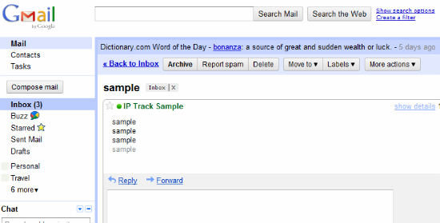

title: JavaScript and single page applications
output: test.html
controls: false

--
# Web apps
## JavaScript and single page applications
## Peter Janakiev
## [regardingscot@gmail.com](mailto:regardingscot@gmail.com)

--

### What is a "single page application"?
* An application that loads only once in the browser and from then on user interaction is conducted without ever leaving the page
* Usually involves a lot of JavaScript
* Lots of "widgets" and "custom elements"

--

### What is a large scale JavaScript program?
* More than 100,000 LOC
* More than 2 developers
* Mostly everything you see from Google as well as Facebook, NYT web view, Meebo, Imo.im, Flowdock etc.

--

### Combined?
* 'Native like' behaviour in the browser.
* Full control of user interaction.
* Off-line
* On your desktop (Chrome apps)
* Access to hardware
* and more..

--

### History

The SPA circa 1999

## 

--

### History

Code looked like this:

    <html>
      
      ...x20
    <body>
    <iframe id="..">
      ...
      

      ...
    </iframe>
    <iframe id=".."></iframe>
    <iframe id=".."></iframe>
    </body>
    </html>

--

### History

Mostly a mess of tricks and quirks:

    document.write('<iframe src="script.js"></iframe>')

    document.write('<script>....</scr' + 'ipt>');

    window.onload=function() {
      top[framename].globalReference[0].method();
    };

    document.write('<object id="KJDSYWUEWDJNWKHDKW32DHWD"></object>');
    // The id is fake, but using the right ID will render
    // ActiveX text edit control in IE<8

--

### History

New bread of apps (Gmail): (circa 2005)

## 

--

### History

Google decides to rock the web by reinventing the JS programming

Develops Closure tools in-house and uses it to refocus Java devs to JavaScript

    /**
     * @constructor
     * @extends {goog.ui.Control}
     * @param {goog.dom.DomHelper=} opt_domHelper
     * @param {goog.ui.ControlRenderer=} opt_renderer
     */
    goog.ui.widget.Calendar = function(opt_domHelper, opt_renderer) {
      ...
    };

--

### History

During the same time in the wild:

* jQuery
* MooTools
* Prototype

--

### History

## Lets make developers life easier:

jQuery

    $('myclassname[type="password"]').on('click', function() {..});

Made it much easier to deal with browsers and allowed to start thinking more for the app logic and less for the host system.

--

### History

## Mootools - Makes inheritance and mixins easier:

    myClass = new Class({
      Extends: [],
      Implements: [],
      initialize: function() {}, // same as constructor function
      method1: function() {},
      method2: function() {
        this.parent(); // call parent method
      }
    });
    // Usage
    new myClass();

--

### History

## The new kind of apps (full screen, very interactive)

## 

--

### History

## Physics engine (base for 2d games)

## 

--

### History

2009 - 2012

ES5, Array methods, shims and polifils become the base for larger projects and frameworks

Vendors start to implements all sort of interesting features to make it easier to develop interactive experiences

--

### History

* CSS3 - transform, translate, filters, shaders, SVG filters etc.
* WebWorkers - CPU intensive tasks
* ArrayBuffers
* FileAPI
* Canvas
* Video / Audio
* WebGL
* WebSocket (tcp -> latency).
* localStorage, webSQL, IndexedDB

--

### History

Companies start developer outreach:

* [Patterns for large scale JS apps](http://addyosmani.com/largescalejavascript/) - Google
* [JavaScript performance best practices](http://developer.nokia.com/Community/Wiki/JavaScript_Performance_Best_Practices) - Nokia
* and mode (Adobe, Microsoft etc).

--

### Present

Data binding: Backbone, AngularJS, Ember - one problem, many solutions, mostly incompatible.

* Useful for data presentation and partially for data interaction models.
* Not very useful for other class of problems (video, audio, images, design, cad/cam etc)

--

### Present

Polymer / Brick - custom sets of polyfils and elements for the Web Components.

* Too idealistic (everything is an Element, including your ajax requests)
* Should be responsive and work on touch (but it does not).
* Still it is not clear how it will fit in what we know as best practices from the last 10 years.

--

### Present

* [fame.us] - custom rendering infrastructure (based on transforms with matrix3d)
* webGL - custom user interfaces (world of Oz)
* games - canvas with sprites and interface with game controlers + fullscreen
* [SkyDrive.com] - M$ Excel and Word for the web
* AppScript - JavaScript for Google applications
* Emscripten - C/C++ compiled to asm.js (or ArrayBuffers)
* LLJS - low level JavaScript (ArrayBuffers and manual memory management)

--

### The future

Mostly Web Components

    <pdf src="mybook.pdf"></pdf>

    // or

    <webglgame resume="true"></webglgame>

    // or

    <excel sheet="mydocument" on-change="saveToCloud"></excel>

Framework to bind them all: use what you already know - DOM, events, splinkle JS here and there.

--

### Today

Lots of tools for lots of tasks:

* requireJS - deps management
* backbone - data binding and synchronization
* jquery (or alternative) for browser compat
* polyfils for Video/Audio/sockets etc.
* less/sass
* lots of plugins and libraries for specific tasks

(more than 50 solutions for charts alone!)

--

### Today

The developer is reading most of the time and trying to make things work together. In lots of tasks there is a solution around the corner and with a little more reading / tweaking it can just work...

--

### Today

What about tasks that there is not solution ready for us?

There comes the "ninja" (no, not THAT "ninja")!

--

### Today

The developer should consider much more than the language itself.

* number of requests
* selector complexity
* dependency management (for JS and for CSS)
* templating language
* backend / frontend rendering
* SEO for SPA (what??)
* source code control
* automation and testing

--

### Today

## How did we got here?

## Technology evolution.
--

### Ajax

AJAX - Initially used for XML with XSLT in the browser (as designed by MicoSoft)

[www.backbase.com/portal-software](www.backbase.com/portal-software) - Initially developed an Ajax library trying to sell it, later reorganized into portal software and later still specialized in banking business.

Today still uses XSLT to operate on data. Good news is Web Component.

Other legacy software.

--
### Ajax for XML (how did it work)

* Fetch the xml and the xsl, transform the root node and insert it in the document.
* Deigned for viewing data, not interacting (innerHTML, replace/add node).
* Poor support in non-IE browsers.

--

### Ajax + JSON

JSON - structured serilization of data that can be parsed right into live JS objects

Circa 2006

* eval
* later - JSON.parse

Much better than XML, but basically used the same ways initially (parse, render using DOM APIs)

--
### Frameworks (2008-...)

The monoliths

* dojo
* YUI
* other..

--

### New players

Data binding: one way, two way, sync

Backbone, Meteor, AngularJS, Ember etc.

--

### Closure compiler

Developed in-house, uses Rhino to parse ES4 style comments and creates AST.

* Its Java
* Understands only a small subset of the language
* Tree-shaking and inlining / renaming - win (for those who are willing to rewrite all).

Do not blindly trust the experts!

--

### JS loaders and minifiers

Circa 2008-2009 more than a dozen of them in the wild with different rate of usefulness.

Lots of "custom" loader code (pretty much the same as 'document.write')

White space stripping is considered 'minification'.

Needed solution because projects get bigger and bigger.

--

### UglifyJS and RequireJS

Made possible by nodejs (4 years ago - 2009).

While still no concensus on it, pretty much the standard.

More than white space removal - real AST of the code.

No cencensus on the "right" module pattern (AMD vs CommonJS)

--

### In style

Less, Sass, Gss.. - make your pick.

Templates - basically the same old story (will probably change with Web Components).

Much better than JS (but still manual dependency management and no straight forward way to require css from code logic)

--

### Popular kids on the block

* Bower
* Yeoman
* HTML5 boilerplate
* Bootstrap
* jQuery UI / jQuery Mobile

## Pretty much you are set... unless you are building a new UX/interaction

--

### Back to the present

## Wellcome to 2013 - everything is "mobile first".

## Its like the 2005, same CPU / RAM available, but this time we have GPU. Unless we dont.

--

### UX/Interaction

What to do when the solution is simply not there?

* grasp as much of what is out there as possible
* strategize (style?)
* choose solution (benchmarking)
* backward compat?

--

### History

## How some companies did it?

--

### Netflix

Largest content provider in the US.

Client for all major platforms (including game consoles, handhels etc).

Decided to go with WebKit.

--

### Netflix - not so fast!

The solution seemed easy - modern rendering engine with modern JS engine - win!

Not really - very low powered, very memory contrained. It simply did not work.

--

### Netflix - solving it.

* Use of transforms and translations.
* Reuse DOM nodes
* Reuse JS Objects (Pooling)

"Infinite" scroll behavior.

[Netflix and webUI](http://techblog.netflix.com/search/label/HTML5)

--

### Netflix - conclusion

You cannot simply visualize 10,000+ items and expect every device to behave.

We still use tricks and optimizations (just like in the old days).

However we have understanding of structure, reusability patterns and testing.

--

### Can we use it?

Yes, you can!

Example: [longa.com/cgi-bin/if.cgi?run=mtvapp&nstableview](longa.com/cgi-bin/if.cgi?run=mtvapp&nstableview)

--

### Google - animation and image loading.

GPU acceleration for your animations (translate3d).

Layer invalidation?

What can we do about it?

--

### Google & Microsoft

NextTick - execute code right after the exit of our call stack

What is wrong with setTimeout(function() {}, *0*)

[jsperf - setTimeout vs nextTick](http://jsperf.com/settimeout-vs-nexttick-polyfill)

[nexttick.js](https://code.google.com/p/closure-library/source/browse/closure/goog/async/nexttick.js)

Be careful with jsPerf!

--

### Mozilla - we will not support h264!

But we have asm.js - just compile your decoder, please:-)

[Broadway](https://github.com/mbebenita/Broadway) - H264 decoder in JavaScript.

Emscripten (no, it is not handwritten)

--

### Facebook vs Sencha

Facebook - html5 / js is a failure.

Sencha - no it is not, its just that you cannot do it right!

[HTML5 love story](http://www.sencha.com/blog/the-making-of-fastbook-an-html5-love-story)

--

### A word for Facebook

* Everyday release (first popularized by Google) - lots of broken stuff but lots of new features and hot fixes.
* React framework - a little too late, but a few good ideas.
* Already implemented in all major frameworks.

--

### Lets get to work!

* What is *__RAF__*
* What is *__setImmediate__*
* Why should we care

--

### Developer console

## Know your tools!

    alert('Debug me!');

Network activity, timeline, frames, JS mem stack, CPU profiles and more

--

### Exercise 1

[Timeline js](https://github.com/ouhouhsami/timeline-js)

* very simple
* clean code
* lots of opportunities for optimization

--

### Exercise 1

Download the code

    git clone URL

Repo: [http://goo.gl/It9NfL](http://goo.gl/It9NfL)

    exercise/1/index.html

--

### Exercise 2

NSTableView

* Implementation for the browser
* Sencha, Netflix, etc.
* Applications?

--

### Excercise 2

    exercise/2/index.html

How to improve it?

* Try making the cell taller and add image(s).
* Scheduled rasterization (raf or nexttick?).

--

### Other exercises

Google+ photo view

Google+ communities / profile page with lots of entries

--

# Questions?

## Get in touch

## [gtalk:regardingscot@gmail.com]()

